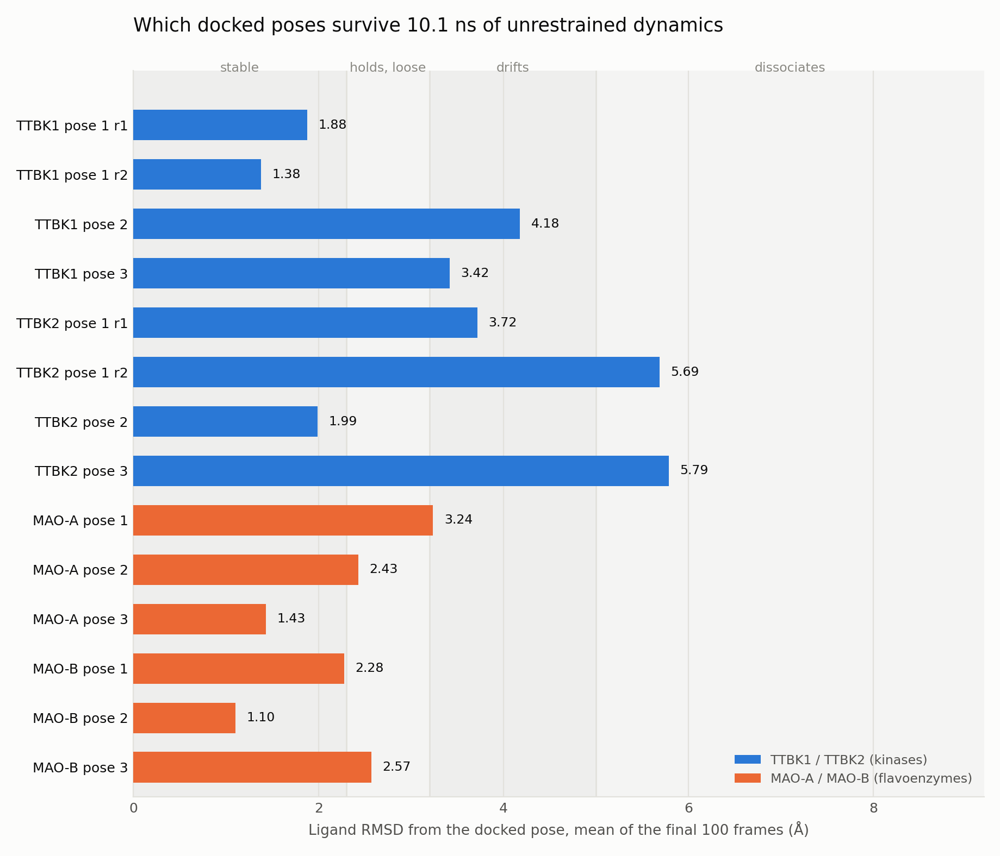
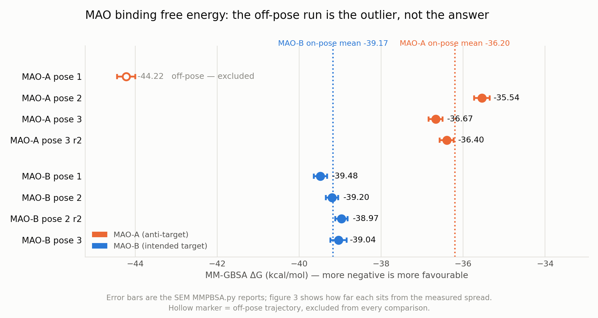
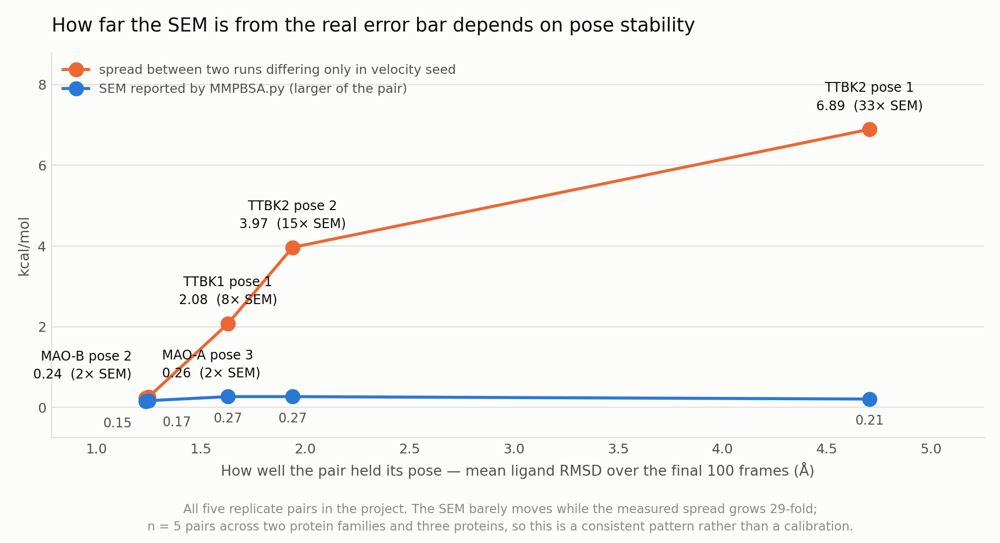

# Step 10 — Results and Interpretation

## What we did

Collected every quantitative result the pipeline produced into one place and asked the only
question that matters for the project: **what can this study actually claim about `cand_003`, and
with what confidence?**

Nothing new was computed here. Every number is read from the primary files in steps 4–8 — mostly
from [`../07_mmgbsa/md_mmgbsa_summary.csv`](../07_mmgbsa/md_mmgbsa_summary.csv), which is itself
regenerated from the `.dat` files by
[`../scripts/collect_md_summary.py`](../scripts/collect_md_summary.py). The figures here are drawn
by [`make_figures.py`](make_figures.py) from that same table, so a figure cannot disagree with the
text, and neither can disagree with what was computed.

## Why we did it

The step READMEs each answer *what happened at that step*. None of them answers **what the study
concludes**, and that gap is where a project like this goes wrong: a reader assembles the headline
from whichever numbers are largest, rather than from the numbers that are valid. This project has
already produced **five** documented instances of exactly that failure, all with the same shape — a
number that looked like a result until someone checked whether the two things being compared
were comparable. The fifth was the subtlest: a replicated arm judged against an unreplicated one,
where both arms looked properly matched in design and the asymmetry was in the *uncertainty*.

So this directory is organised by **claim**, not by method, and every claim carries its status.

---

## The project's question

A dual-target design: one molecule intended to inhibit **TTBK1** (a tau kinase implicated in
Alzheimer's disease) and **MAO-B**, while *avoiding* their close relatives.

| Protein | Role | Why the distinction matters |
|---|---|---|
| **TTBK1** (7JXX) | intended target | tau phosphorylation |
| TTBK2 (7Q8Y) | **anti-target** | loss-of-function mutations cause spinocerebellar ataxia type 11, so unintended TTBK2 inhibition is a specific safety liability |
| **MAO-B** (2V5Z) | intended target | the neurodegeneration-relevant isoform |
| MAO-A (2Z5X) | **anti-target** | MAO-A inhibition without MAO-B selectivity raises the tyramine pressor risk ("cheese effect") |

Both safety rationales are the manuscript's own (§4). They are what make *selectivity*, not
potency, the load-bearing claim of the study — and therefore what the MD and MM-GBSA work was
built to test.

### The lead compound

`cand_003` — `Cc1cc(-c2oc3cccc(O)c3c(=O)c2O)ccc1C(F)(F)F`, a trifluoromethyl/methyl-substituted
flavonol from the REINVENT4 campaign.

| MW | WLogP | TPSA | HBD | HBA | Lipinski | BBB | GI absorption | Structural alerts |
|---|---|---|---|---|---|---|---|---|
| 336.27 | 4.20 | 70.67 Ų | 2 | 4 | 0 violations | pass | pass | 0 |

Docking consensus over 3 seeds on the validated receptors: **−8.39 kcal/mol on TTBK1 (7JXX),
rank 8 of 56** and **−11.41 on MAO-B (2V5Z), rank 2 of 56**. **Read those ranks with Result 5:**
they are Vina's, and an independent scoring function puts the same compound at 12 and 10 of 56
while disagreeing with Vina about which compound is best in either arm. The absolute
favourability reproduces; the rank is not a reproducible quantity. It is drug-like and BBB-permeant on
the computed gates, which for a CNS target is the precondition for anything else mattering.

---

## Result 1 — Most docked poses do not survive dynamics

Seventeen systems, 10.1 ns each, ligand RMSD from the docked pose averaged over the final 100
frames. Stability is judged on that window rather than the whole run, because a ligand that leaves
late still shows a low whole-run average.

**Nine of seventeen runs hold their pose; two leave the site entirely.** The immediate consequence
is that a docking score is not evidence of binding: it ranks poses, and the ranking does not
predict which pose is physically stable.

**Docking rank predicted the most stable pose in one of four targets.** Only TTBK1's top-ranked
pose won. MAO-A's best-holding pose is its *worst*-ranked of three (pose 3, Vina −7.40 against
pose 1's −8.24). With 3 poses × 4 targets this is the most strongly supported methodological
finding in the project, and it is why every energy below is tied to a named pose.

**The MAO complexes are the more stable pair.** No MAO run left the site — the worst is 3.24 Å,
against two TTBK runs past 5 Å. Counting strictly, MAO-A holds 1 of 3 and MAO-B 2 of 3.

Protein backbones were stable throughout — **1.34–1.90 Å** across the eight TTBK runs and
**1.06–1.77 Å** core-fit across the eight MAO runs — so the ligand motion is ligand motion, not a
collapsing binding site. Two apparent exceptions, `system_MAOA_p3_r2` at 3.64 Å and
`system_MAOA_p2` at 3.44 Å whole-protein (the two highest in the project), are the solvent-exposed
C-terminal tail of the MAO-A construct flailing without a membrane to sit in, not unstable folds:
per-residue RMSF puts the maximum at residues 506–513 of 513 in both, and the cores are 1.50 and
1.28 Å. `p3_r2` carries the project's **most stable ligand** (1.07 Å) alongside its **highest
backbone number**, which is the sharpest illustration that a whole-protein RMSD says nothing on
its own about the binding site.

## Result 2 — For MAO, the intended selectivity is supported in direction

This is the study's central new result, and it reversed itself once the poses were done properly.

On-pose, MAO-A lands at −35.54 / −36.67 / −36.40 and MAO-B at −39.48 / −39.20 / −38.97 /
−39.04. **All twelve on-pose pairings favour MAO-B, by 2.30 to 3.94 kcal/mol** — the intended
direction, since MAO-A is the anti-target. Docking independently favours MAO-B by 3.03–3.22
kcal/mol pose for pose. Two methods that disagreed now agree.

**And the size of the margin now has a measured error bar.** Velocity replicates of both
best-pose systems — identical topology and coordinates, differing only in the random velocity
seed — give run-to-run spreads of **0.26** (MAO-A pose 3) and **0.24** (MAO-B pose 2) kcal/mol.
Comparing replicate means, MAO-A −36.53 against MAO-B −39.09 is a **ΔΔG of 2.55 kcal/mol,
9.8× the larger spread.** Both replicates also reproduced the pose stability (1.07 and 1.37 Å).

The caveat that must travel with that number: FAD is positionally restrained in both arms, which
suppresses receptor motion and so damps the run-to-run variation. 0.24–0.26 is the right error bar
*for this protocol*, not evidence that MM-GBSA is intrinsically this precise. The ΔΔG is fair
because **both arms carry the same restraint.**

**What made them disagree was one off-pose trajectory.** MAO-A pose 1 gives −44.22, the most
favourable MAO-A value by 7.55 kcal/mol and the only one from a run that had drifted off its docked
pose (3.24 Å). Taken at face value it says the compound prefers the anti-target — a selectivity
*and* safety liability that does not exist. Every on-pose MAO-A trajectory lands near −36.

This is the clearest case in the project of an off-pose trajectory producing not a noisy number but
an **inverted conclusion**, and it is the strongest argument for the rule the project already
follows: never compute a binding energy on a trajectory that has left its docked pose.

## Result 3 — For TTBK, there is no resolvable discrimination

**As of 2026-09-28 both arms carry their own measured error bar**, and the comparison collapsed
further. TTBK1's replicate mean is −32.40 (spread 2.08); TTBK2 pose 2's replicate mean is
−32.93 (spread **3.97**). The ΔΔG computed from two replicate means rather than one single run
is **0.53 kcal/mol** — down from the 1.45 quoted while TTBK2 had only one trajectory, and
**7.4× smaller than the larger of the two spreads.** Pose stability says the same thing: 1 of 3
poses hold on each kinase under a symmetric test, and TTBK2 pose 2 held in both replicates
(1.99 and 1.89 Å).

The earlier 1.45 figure was not wrong, but it was **asymmetric**: it judged a two-arm difference
using one arm's uncertainty, because the TTBK2 arm had no replicate. Measuring that arm did not
merely add an error bar, it moved the central value — which is the whole argument for measuring
it.

Three independent lines say the original TTBK2 liability claim does not survive:

- The +0.12 kcal/mol docking margin came from a receptor pair with **five waters in one site and
  none in the other**; run water-symmetrically, the margin *reverses* to favour TTBK2 by ~1.6.
- The protocol carries a **~1.0 ± 0.25 kcal/mol systematic bias toward TTBK2** on the 9IV pair,
  against a same-assay experimental ΔΔG of −0.234 kcal/mol. Any margin below **~1.3** — the
  bias plus its own uncertainty — is inside it. That uncertainty is 16× the docking SEM, so it
  is set by the experimental reference, not by the docking.
- MD and MM-GBSA find no resolvable difference.

**The honest outcome is that dynamics lacks the resolution to speak on TTBK1 vs TTBK2 at all.**
That is not a null result to be buried — a margin of 1.45 or 0.53 kcal/mol quoted against the
reported SEM of 0.27 would have looked like a five-sigma selectivity finding either way.

## Result 4 — The reported SEM is not the error bar

`MMPBSA.py` computes its standard error as if ~200 frames sampled 10 ps apart were independent
draws. They are not. Across the project's **five** replicate pairs the reported SEM stays in a
narrow 0.15–0.27 kcal/mol band while the measured spread between two runs differing *only* in
velocity seed ranges from 0.24 to 6.89 — a **29-fold** range.

**And the discrepancy is not random: it tracks pose stability, monotonically across all five
pairs.**

| Pair | Mean ligand RMSD | Measured spread | Ratio to SEM |
|---|---|---|---|
| MAO-B pose 2 | 1.24 Å | 0.24 | 2× |
| MAO-A pose 3 | 1.25 Å | 0.26 | 2× |
| TTBK1 pose 1 | 1.63 Å | 2.08 | 8× |
| **TTBK2 pose 2** | **1.94 Å** | **3.97** | **15×** |
| TTBK2 pose 1 | 4.71 Å | 6.89 | 33× |

**The fifth pair, added 2026-09-28, landed where the trend predicted.** TTBK2 pose 2 was run as a
replicate to give the TTBK2 arm its own error bar, not to test this relationship — and its spread
of 3.97 kcal/mol sits between TTBK1's 2.08 and TTBK2 pose 1's 6.89, in the same order as its
ligand RMSD. **Ordered by RMSD, the measured spread is now monotonic across all five pairs.** The
ratio column is monotonic too, except that the two MAO pairs are tied within 0.01 Å of RMSD
(1.6× at 1.24 Å against 1.5× at 1.25 Å), which is why both are quoted as 2×.

The mechanism is straightforward once seen: a trajectory leaving the site samples structures that
were never the complex, so its energy swings between seeds; a tightly held pose samples one basin
and returns nearly the same number twice.

**Quoting the SEM as the uncertainty on a ΔΔG is the single easiest way to manufacture a
significant selectivity result from this pipeline.** Without the second replicate, that is exactly
what would have happened for TTBK — and the TTBK2 replicate of 2026-09-28 sharpened the point
again, because it moved the ΔΔG itself from 1.45 to 0.53 kcal/mol.

The rule this yields is sharper than "never trust the SEM": **the SEM is only as good as the pose
is stable, and you cannot tell which case you are in without running a replicate.** The MAO
magnitude is quotable because the replicate was run — not because its poses looked stable. With
n = 5 pairs across two protein families and three proteins this is a consistent pattern, not a
calibration curve.

---

## Result 5 — Docking rank is not reproducible across scoring functions

All 56 candidates were rescored on both validated on-targets with **Vinardo**, three seeds each,
at identical box, exhaustiveness, `num_modes` and seeds — 336 dockings in which **only the
scoring function differs.** This was the one cross-check the project had never run on the
receptors it actually reports; the only prior Vinardo data was measured on a superseded receptor
set whose TTBK1 structure was apo and carried no passing redocking validation.

| | TTBK1 (7JXX) | MAO-B (2V5Z) |
|---|---|---|
| Pearson, all 56 | +0.489 (p = 1.3×10⁻⁴) | +0.690 (p = 4.1×10⁻⁹) |
| **Pearson, top 15** | **+0.354 (p = 0.20, n.s.)** | **+0.142 (p = 0.62, n.s.)** |
| Top-15 membership overlap | 8 of 15 | 6 of 15 |
| Best compound | `cand_013` vs `cand_002` | `cand_043` vs `cand_001` |
| `cand_003` rank | 8 vs 12 of 56 | 2 vs 10 of 56 |

**The all-56 row is the reassuring one and it is the wrong one to read.** That correlation is
carried by dynamic range — both functions agree that weak binders are weak. Restrict to the
slice where selection actually happens and the Vina spread collapses from 1.87 to 0.60 kcal/mol at
TTBK1 and from 2.92 to 0.77 at MAO-B, and the correlation collapses with it, to
**non-significance on both targets.**

**This is not seed noise.** Mean inter-seed SD is 0.065 and 0.012 kcal/mol for Vina and 0.012 and
0.009 for Vinardo — one to two orders of magnitude below the disagreement. The two functions
genuinely disagree; the search is not what is unstable.

So **absolute favourability reproduces and fine-grained rank does not.** Every candidate again
scores favourably under Vinardo (−7.72 to −4.99 at TTBK1, −9.42 to −4.55 at MAO-B), and
neither arm's best compound agrees between functions.

**What survives about the lead is weaker but real.** `cand_003` sits in the **top 12 of 56 under
both functions on both targets** (top ~21%): robustly good, not demonstrably best. No ranking in
this project should be read as identifying a uniquely best compound.

**Read alongside Result 1, this is the same finding reached from the opposite direction.** Result 1
tests docking rank against physics and finds it does not predict which pose survives dynamics.
Result 5 tests docking rank against itself and finds it is not even reproducible between two
empirical functions. Together they are why pose stability, not score, has been the discriminating
filter at every step of this project.

**The two functions are never pooled or averaged.** They run on different scales, and a consensus
of two scoring functions masks a weak score rather than corroborating it — in the prior phase a
combined Vina+Vinardo z-score ranking nearly selected a different lead. Vinardo output is kept in
`../04_docking/crosscheck/vinardo/`, one directory level below the globs the Vina collectors use,
so it cannot be pooled into a consensus or a selectivity margin even by accident. A *third*
empirical function would not help: two disagreeing functions of the same kind cannot be
adjudicated by a third of the same kind.

---

## What the project can and cannot claim

This is the section to write the thesis and the manuscript Results from.

| # | Claim | Status | Rests on |
|---|---|---|---|
| 1 | `cand_003` is drug-like and BBB-permeant on computed gates | **Supportable** | 0 Lipinski violations, BBB + GI pass, 0 structural alerts |
| 2 | Docking rank does not predict which pose survives dynamics | **Supportable, strongly** | top-ranked pose most stable in 1 of 4 targets; 3 poses each, 16 runs; and see claim 11, where rank is not reproducible between scoring functions either |
| 3 | `cand_003` forms a stable complex with MAO-B | **Supportable** | 2 of 3 poses hold (1.10, 2.28 Å); no MAO-B run left the site |
| 4 | `cand_003` forms a stable complex with TTBK1 | **Supportable, pose-specific** | pose 1 holds in both replicates (1.88, 1.38 Å); poses 2–3 drift |
| 5 | The compound favours MAO-B over MAO-A — the intended direction | **Supportable** | all 12 on-pose pairings agree; docking agrees independently |
| 6 | …by about 2.55 kcal/mol | **Supportable, protocol-bound** | 9.8× the measured 0.24–0.26 replicate spread; both arms share the FAD restraint that damps it |
| 7 | The compound is selective for TTBK1 over TTBK2 | **Not supportable** | ΔΔG 0.53 against measured spreads of 2.08 (TTBK1) and 3.97 (TTBK2); no pose-stability difference |
| 8 | TTBK2 is an off-target liability for this series | **Docking only** | reverses under a symmetric water shell; inside the ~1.0 protocol bias |
| 9 | The reported SEM is not a usable error bar, and its failure scales with pose instability | **Supportable, strongly** | 5 replicate pairs, ratio 2× to 33×, spread monotonic in ligand RMSD |
| 10 | Absolute ΔG values are comparable between targets | **Not supportable** | protein-specific desolvation/surface terms do not cancel |
| 11 | Fine-grained docking rank is not reproducible across scoring functions | **Supportable, strongly** | top-15 Pearson +0.354 (p 0.20) and +0.142 (p 0.62); different best compound in both arms; 56 ligands × 2 targets × 3 seeds |

### Two things not to write

**Do not quote the −44.22.** It is the most attractive number in the dataset and it describes a
structure that was never docked. It is kept on record only as the cautionary case.

**Do not put TTBK and MAO binding energies on the same axis.** They carry protein-specific terms
that do not cancel; MAO-A's −44.22 against TTBK1's −31.36 compares a flavoenzyme to a kinase and
means nothing. Figure 2 is MAO-only for this reason, and figure 1 shares an axis legitimately
because ligand RMSD is a geometric measure of one ligand against its own starting pose.

---

## Limitations

Stated plainly, because each one bounds a claim above.

1. **One ligand.** Every MD and MM-GBSA number is for `cand_003`. Nothing here generalises to the
   series without more runs.
2. **10.1 ns per run.** Long enough to see a pose fail, too short for a binding/unbinding
   equilibrium or a slow conformational change.
3. **Single-trajectory MM-GBSA, no entropy term.** These are interaction-energy estimates, not
   binding free energies in the thermodynamic sense, and their absolute values are not comparable
   to experiment.
4. **Two replicates per arm at most.** Every arm now carries one measured replicate pair — MAO-A
   pose 3, MAO-B pose 2, TTBK1 pose 1 and TTBK2 pose 2, plus the off-pose TTBK2 pose 1 pair.
   That is enough to measure a spread, and for MAO to show the ΔΔG clears it ~10-fold; it is
   not enough to put a confidence interval on the spread itself, which is what a formal claim
   about the MAO ΔΔG would eventually need. A third and fourth replicate per arm would turn the
   spreads from point estimates into distributions.
5. **FAD is a restrained GAFF2 residue, not the covalent 8α-S-cysteinyl cofactor it really is.**
   Beyond the induced-fit point below, this is also why the MAO replicate spread is so tight — the
   restraint removes receptor motion that would otherwise vary between seeds.
   The flavin wall of the cavity is reproduced and validated (0.46–0.73 Å from crystal across all
   eight MAO systems), but FAD cannot relax in response to the ligand, so induced fit involving the
   flavin is suppressed. Defensible for ligand MM-GBSA, where FAD is part of the receptor on both sides of
   the subtraction; not a substitute for covalent parameterisation.
6. **No experimental validation.** Everything here is computational. The IC50 values in
   [`../01_smiles/`](../01_smiles/) are literature anchors for reference compounds, not measurements
   of `cand_003`.
7. **One docking engine, two scoring functions, and they disagree on rank** (Result 5). Absolute
   favourability is reproduced across functions but fine-grained rank is not, so the shortlist
   should be treated as a set of plausible candidates rather than an ordered list. This bounds
   every rank quoted in this file, including `cand_003`'s own 8 of 56 and 2 of 56.

## What would change the answer

- **To support claim 7 either way**, the TTBK arm needs either much longer sampling or an
  alternative free-energy method. With both arms now replicated the picture is worse, not better,
  for more of the same: the resolution floor is ~4 kcal/mol (the larger measured spread) against
  an effect size of ~0.53, and the ~1.3 kcal/mol calibration floor sits between them.
- **To generalise beyond `cand_003`**, MD the next two or three shortlisted candidates. Pose
  stability has been the discriminating filter at every step and is cheap relative to its value.
  **Result 5 makes this the priority rather than one option among several:** docking rank cannot
  identify a best compound, and adding a third empirical scoring function would not settle a
  disagreement between two. Short MD on the shortlist is the only available method that has
  actually separated these compounds. Ligand parameterisation for this is no longer blocked.
- **To put a confidence interval on the error bars themselves**, a third and fourth replicate per
  arm would turn the spreads from point estimates into distributions — what a formal claim about
  the MAO ΔΔG would eventually need (limitation 4).

## Relevant files

| File | Role |
|---|---|
| [`make_figures.py`](make_figures.py) | draws all three figures from the collected table; rerun after any new MD |
| [`fig1_pose_stability.png`](fig1_pose_stability.png) | result 1 — which poses survive |
| [`fig2_mao_binding_energy.png`](fig2_mao_binding_energy.png) | result 2 — the MAO comparison |
| [`fig3_sem_vs_replicate.png`](fig3_sem_vs_replicate.png) | result 4 — the error-bar finding |
| [`../07_mmgbsa/md_mmgbsa_summary.csv`](../07_mmgbsa/md_mmgbsa_summary.csv) | **the source table** — every RMSD and energy quoted here |
| [`../scripts/collect_md_summary.py`](../scripts/collect_md_summary.py) | regenerates that table from primary `.dat` files; `--check` fails if stale |
| [`../08_analysis/selectivity_margins.csv`](../08_analysis/selectivity_margins.csv) | per-candidate docking margins against each anti-target |
| [`../08_analysis/vinardo_crosscheck.csv`](../08_analysis/vinardo_crosscheck.csv) | **result 5's source table** — per-ligand Vina and Vinardo scores and ranks, both receptors |
| [`../scripts/audit_vinardo.py`](../scripts/audit_vinardo.py) | recomputes every number in result 5 from that table; 66 checks |
| [`../08_analysis/filter_cascade_candidates_56.csv`](../08_analysis/filter_cascade_candidates_56.csv) | the ADMET/BBB properties in the lead table above |
| [`../LOGBOOK.md`](../LOGBOOK.md) | the chronological record, and the authoritative account of *why* — including every defect found |
| [`../09_manuscript/README.md`](../09_manuscript/README.md) | which manuscript claims need revising, section by section |

Where this file and the logbook disagree, **the logbook is the primary source.**
